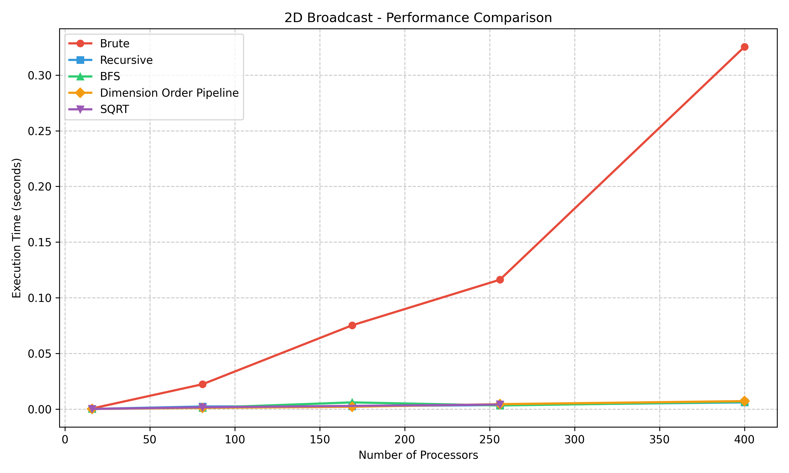
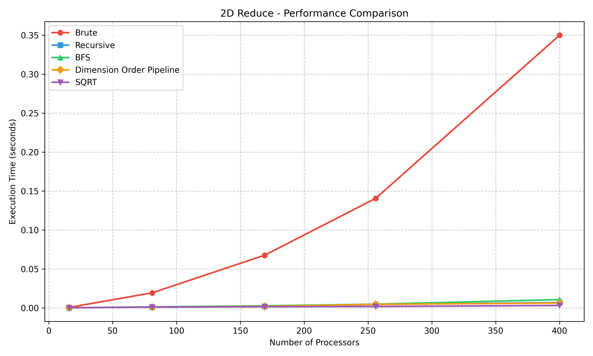
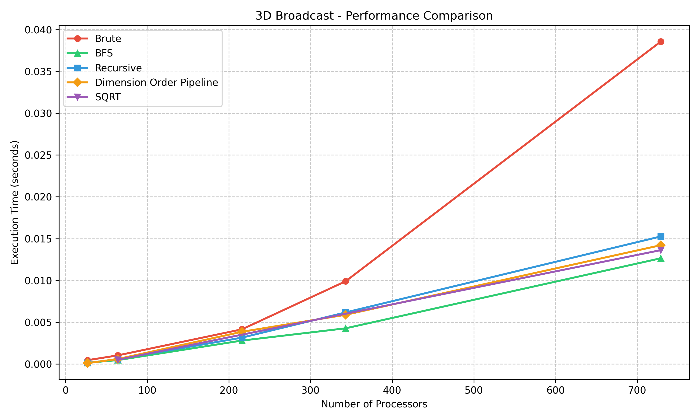
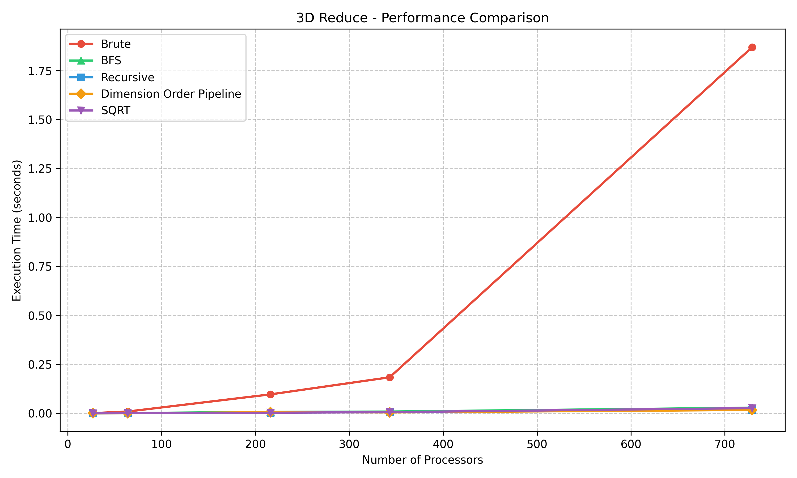

# MPI Mesh Topologies Implementation Project

## Overview
This project implements and analyzes various broadcast and reduction algorithms on 2D and 3D Mesh topologies using MPI (Message Passing Interface). It compares the performance of different implementations across varying numbers of processors.

## Algorithms Implemented
- **Brute Force:** Basic implementation using point-to-point communication.
- **Recursive Doubling:** Logarithmic time complexity algorithm.
- **BFS (Breadth-First Search):** Spreading messages layer by layer.
- **Dimension Order Pipeline:** Optimization for mesh topologies utilizing dimension-ordered routing.
- **SQRT (Square Root):** A hybrid approach for optimal message passing in grid structures.

## Project Structure
```
.
├── 2D/                     # 2D Mesh Implementations
│   ├── Broadcast/         # Broadcast Algorithms
│   └── Reduce/            # Reduce Algorithms
├── 3D/                     # 3D Mesh Implementations
│   ├── Broadcast/         # Broadcast Algorithms
│   └── Reduce/            # Reduce Algorithms
├── Chunking/               # Chunking optimizations
│   ├── 2D/
│   ├── 3D/
├── chunking_plots/         # Chunking performance visualization
├── plots/                  # Performance plots generated from timing files
├── website-visualizations/ # Interactive HTML visualizations
├── visualize_performance.py # Script to generate performance plots
├── 2D-Broadcast-times.txt  # Raw 2D broadcast timings
├── 2D-Reduce-times.txt     # Raw 2D reduce timings
├── 3D-Broadcast-times.txt  # Raw 3D broadcast timings
├── 3D-reduce-times.txt     # Raw 3D reduce timings
└── run_all.sh              # Script to build and run everything
```

## How to Run

### Prerequisites
- MPI Compiler (`mpic++`, `mpirun`)
- Python 3 with `matplotlib` and `numpy`

### Build and Run All
To compile all programs, run the experiments, and generate the plots:

```bash
chmod +x run_all.sh
./run_all.sh
```

**Note:** One needs to manually add the times taken for the algorithms to `2D-Broadcast-times.txt`, `2D-Reduce-times.txt`, `3D-Broadcast-times.txt` and `3D-Reduce-times.txt`. After that, one can proceed with plotting the times.

### Manual Compilation
You can compile individual components:

```bash
cd 2D/Broadcast
make
```

### Generating Plots
To generate the performance plots from the timing files:

```bash
python3 visualize_performance.py
```

## Performance Analysis
The project compares the execution time of different algorithms as the number of processors increases.

### 2D Broadcast

*(See `plots/2d_broadcast_no_brute.png` for a detailed view excluding Brute force)*

### 2D Reduce


### 3D Broadcast


### 3D Reduce


## Observations
- **Brute Force** scales poorly with the number of processors, as expected.
- **Recursive Doubling** and **BFS** show significantly better performance, with logarithmic scaling characteristics.
- **Dimension Order Pipeline** demonstrates the best stability and performance for larger grids in our specific topology.
- **Chunking** provides benefits for large message sizes by overlapping communication, though it incurs overhead for smaller messages.

## Website Visualizations
Interactive visualizations of the message passing patterns can be found in the `website-visualizations/` directory. Open the HTML files in a browser to view the animations. 
